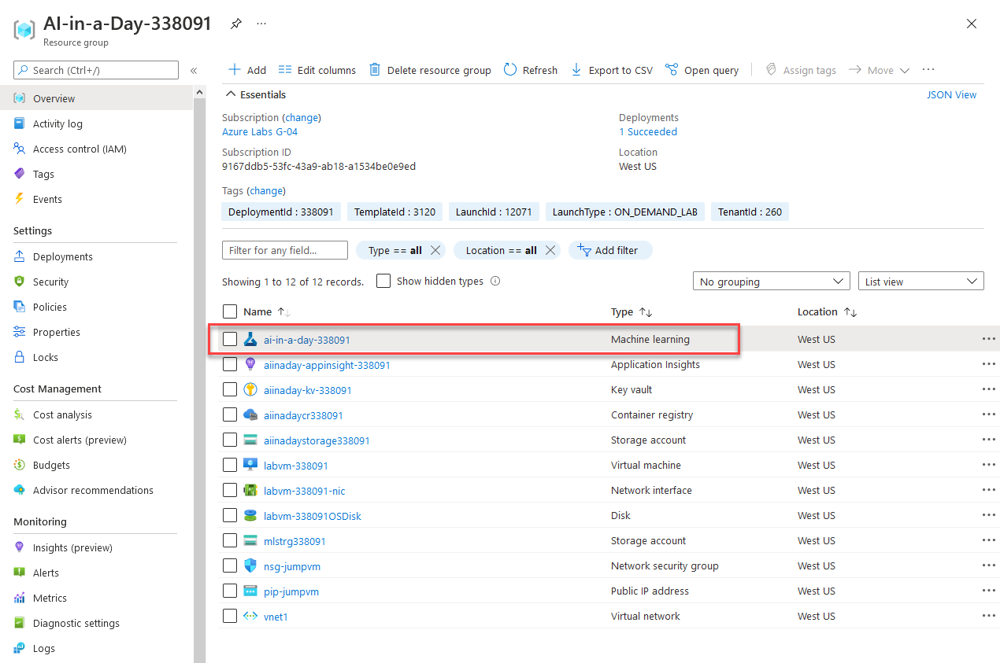

# Lab 1 - Azure Machine Learning Model Training

This lab covers clustering with Azure Machine Learning, Automated ML, and model explainability.

## Task 1 - Explore dashboard of COVID-19 data

Understanding the source datasets is very important in AI and ML. To help you expedite the process, we have created a Power BI dashboard you can use to explore them at the begining of each lab.

To get more details about the source datasets, check out the [Data Overview](../data-overview.md) section.

To explore the dashboard of COVID-19 data, open the `Azure-AI-in-a-Day-Data-Overview.pbix` file located on the desktop of the virtual machine provided with your environment.

## Task 2 - Explore lab scenario

Given the magnitude of the COVID-19 problem, it comes naturally to have a lot of research on the topic. In fact, in 2020 alone, tens of thousands of papers have been published on COVID-19 alone. The sheer amount of communication on the subject makes it difficult for a researcher to grasp and structure all the relevant topics and details. Furthermore, pre-defined catalogs and papers classification might not always reflect their content in the most effective way possible.

Based on a set of existing research papers, we will use Natural Language Processing and Machine Learning to identify these papers' natural grouping. For each new document that gets into our system, we will use Machine Learning to classify it into one of the previously identified groups. We will use Automated ML (a feature of Azure Machine Learning) to train the best classification model and explain its behavior.

The following diagram highlights the portion of the general architecture covered by this lab.

The high-level steps covered in the lab are:

- Explore dashboard of COVID-19 data
- Explore lab scenario
- Run word embedding process on natural language content of research papers
- Explore results of word embedding
- Run clustering of research papers and explore results
- Use the newly found clusters to label research document and run Auto ML process to train a classifier
- Run the classifier on "new" research papers
- Explain the best model produced by AutoML

## Task 3 - Prepare Azure Machine Learning workspace

1. Open the [Azure Portal](https://portal.azure.com) and sign-in with your lab credentials.

2. In the list of your recent resources, locate the Azure Machine Learning workspace, select it, and then select `Launch studio`. If you are prompted to sign-in again, use the same lab credentials you used at the previous step.

3. In Azure Machine Learning Studio, select `Compute` from the left side menu and verify that your compute instance is running.

>Note:
>
>If you launched Azure Machine Learning Studio right after your lab environment was provisioned, you might find the compute instance in a provisioning state. In this case, wait a few minutes until it changes its status to `Running`.

4. From the `Application URI` section associated with the compute instance, select `Jupyter`.

5. In the Jupyter notebook environment, navigate to the folder associated with your lab user.

6. If the folder does not contain any notebooks, download the following items to your local machine:

[1. Data Preparation.ipynb](https://solliancepublicdata.blob.core.windows.net/ai-in-a-day/lab-01/1.%20Data%20Preparation.ipynb)

[2. Automated ML.ipynb](https://solliancepublicdata.blob.core.windows.net/ai-in-a-day/lab-01/2.%20Automated%20ML.ipynb)

[3. Document Classification.ipynb](https://solliancepublicdata.blob.core.windows.net/ai-in-a-day/lab-01/3.%20Document%20Classification.ipynb)

[covid_embeddings_model_1000_docs.w2v](https://solliancepublicdata.blob.core.windows.net/ai-in-a-day/lab-01/covid_embeddings_model_1000_docs.w2v)

Upload each file by selecting the `Upload` button from the top right corner of the screen, and then selecting the blue `Upload` button to confirm. 

## Task 4 - Prepare data for the Machine Learning process

1. With the Azure Machine Learning studio and the Jupyter notebook environment open, select the `1. Data Preparation.ipynb` notebook.

2. Execute the notebook cell by cell (using either Ctrl + Enter to stay on the same cell, or Shift + Enter to advance to the next cell) and observe the results of each cell execution.

## Task 5 - Train a Machine Learning model with Automated ML

1. With the Azure Machine Learning studio and the Jupyter notebook environment open, select the `2. Automated ML.ipynb` notebook.

2. Execute the notebook cell by cell (using either Ctrl + Enter to stay on the same cell, or Shift + Enter to advance to the next cell) and observe the results of each cell execution.

## Task 6 - Classify new research documents

1. With the Azure Machine Learning studio and the Jupyter notebook environment open, select the `3. Document Classification.ipynb` notebook.

2. Execute the notebook cell by cell (using either Ctrl + Enter to stay on the same cell, or Shift + Enter to advance to the next cell) and observe the results of each cell execution.
