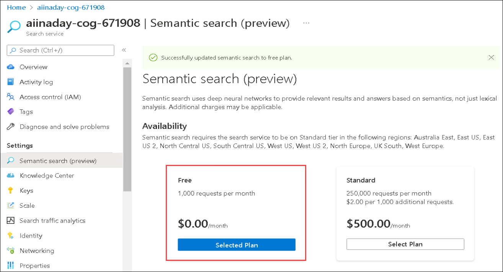

# Lab 2b - Knowledge Mining with Azure Cognitive Search

This lab covers Azure Cognitive Search Services, particularly Semantic search using [Semantic Query](https://docs.microsoft.com/en-us/azure/search/semantic-how-to-query-request?tabs=semanticConfiguration%2Cportal#create-a-semantic-configuration) and the [return a semantic answer](https://docs.microsoft.com/en-us/azure/search/semantic-answers?tabs=semanticConfiguration).

## Task 1 - Enabling the Semantic search (preview) in Cognitive Search service

Semantic search is a premium feature in Azure Cognitive Search that invokes a semantic ranking algorithm over a result set and returns semantic captions (and optionally semantic answers), with highlights over the most relevant terms and phrases. Both captions and answers are returned in query requests formulated using the "semantic" query type.

Captions and answers are extracted verbatim from text in the search document. The semantic subsystem determines what part of your content has the characteristics of a caption or answer, but it does not compose new sentences or phrases. For this reason, content that includes explanations or definitions work best for semantic search.

1. Navigate to **AI-in-a-Day** resource group [the Azure portal](https://portal.azure.com).

2. Locate **Search service** resource **aiinaday-cog-<inject key="DeploymentID" enableCopy="false"/>** and select that.

   
   
3. Select the **Semantic search (preview)** under settings in the left menu.

   
   
4. From the Semantic search (preview) pane, select **Free** tier by clicking on **Select Plan**. Once you click on select plan, a free tier plan will be selected for Semantic search.

   
