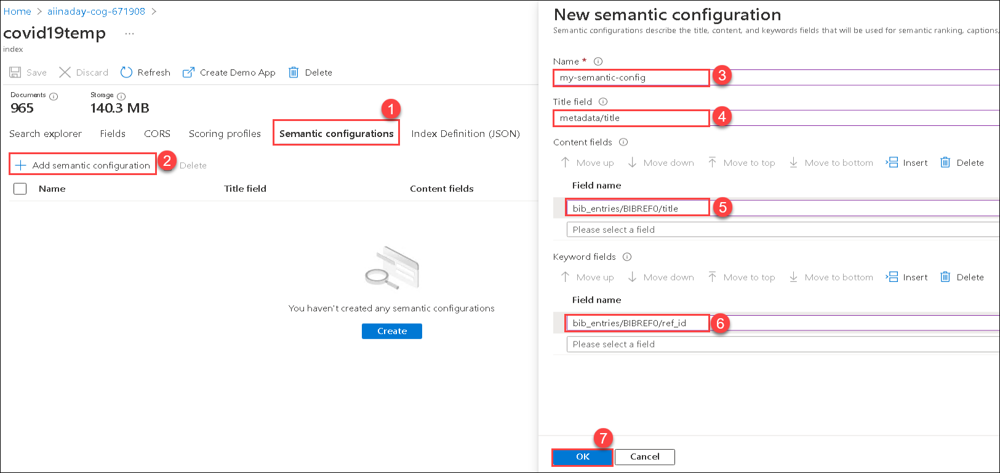

# Lab 2b - Knowledge Mining with Azure Cognitive Search

This lab covers Azure Cognitive Search Services, particularly [Semantic ranking](https://docs.microsoft.com/en-us/azure/search/semantic-ranking) using [semantic query](https://docs.microsoft.com/en-us/azure/search/semantic-how-to-query-request?tabs=semanticConfiguration%2Cportal#create-a-semantic-configuration) and [return a semantic answer](https://docs.microsoft.com/en-us/azure/search/semantic-answers?tabs=semanticConfiguration).

Semantic search is a premium feature in Azure Cognitive Search that invokes a semantic ranking algorithm over a result set and returns semantic captions (and optionally semantic answers), with highlights over the most relevant terms and phrases. Both captions and answers are returned in query requests formulated using the "semantic" query type.

Semantic ranking is an extension of the query execution pipeline that improves precision by reranking the top matches of an initial result set. In order to complete processing within the expected latency of a query operation, inputs to the semantic ranker are consolidated and reduced so that the underlying summarization and reranking steps can be completed as quickly as possible.

## Task 1 - Enabling the Semantic search (preview) in Cognitive Search service

1. Navigate to **AI-in-a-Day** resource group in the [Azure portal](https://portal.azure.com).

2. Locate **Search service** resource **aiinaday-cog-<inject key="DeploymentID" enableCopy="false"/>** and select it.

   
   
3. Select the **Semantic search (preview)** under settings in the left menu.

   
   
4. From the Semantic search (preview) pane, select **Free** tier by clicking on **Select Plan**. Once you click on select plan, a free tier plan will be selected for Semantic search.

   
   
## Task 2 - Creating a Semantic configuration

1. Naviagte to **Overview**(1) of **Search service** resource **aiinaday-cog-<inject key="DeploymentID" enableCopy="false"/>** and then select **Indexes**(2). You will be able to see the list of indexes, click on **covid19temp**(3) index for adding semantic configuration.

   
   
2. In the **covid19temp** index pane, select **Semantic configurations**(1) and click on **+ Add semantic configuration**. You will see a tab appears at right-side with **New semantic configuration**, enter the below values:

    | Parameter                   | Value                                        |
    | --------------------------- | -------------------------------------------- |
    | Name (3)                    | my-semantic-config                           |
    | Title field (4)             | Select `metadata\title` from the drop-down   |
    | Field name under Content fields (5) | Select `bib_entries/BIBREFO/title` from the drop-down |
    | Field name under Key fields (6)    | Select `bib_entries/BIBREFO/ref_id` from the drop-down |
  
  Click on **Ok**(7).
  
  
  
3. You will be able to see the added semantic configuration under Semantic configurations tab, click on **Save** to save the changes made.

   
