# Lab 5 - Conversational AI with Azure Bot Service and Cognitive Services

With Machine Learning (ML) and Natural Langauge Processing (NLP), Human Machine Interface (HMI) technologies are enjoying an increased adoption year over year. By 2021, [the growth of chatbots in this space is expected to be 25.07%](https://www.technavio.com/report/chatbot-market-industry-analysis). This lab will focus on conversational AI and NLP to help analysts dig into vast amounts of research documents. 

First, we will start with a prepopulate Azure Cognitive Search knowledge base enhanced with Azure Cognitive Services to test our foundational Bot based on old-fashion keyword lookup, regular expressions. Next, we will extend our conversational Bot's behavior using the Bot Framework Composer and Azure Language Understanding (LUIS). Finally, we will deploy our Bot to Azure Bot Service.

## Task 1 - Setting Azure Cognitive Search for a Chatbot

1. Download the starter [Bot project ZIP file](AI-in-a-Day-Bot.zip) to your **Documents** folder. Extract the contents of the ZIP file.

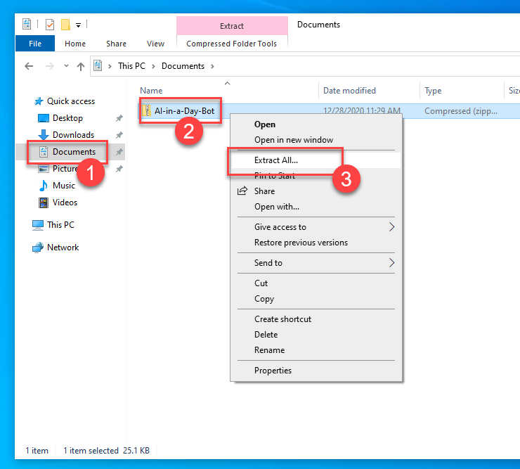

2. Launch the **Bot Framework Composer (1)** from its shortcut on Desktop. Select **Open (2)** to load our starter project.

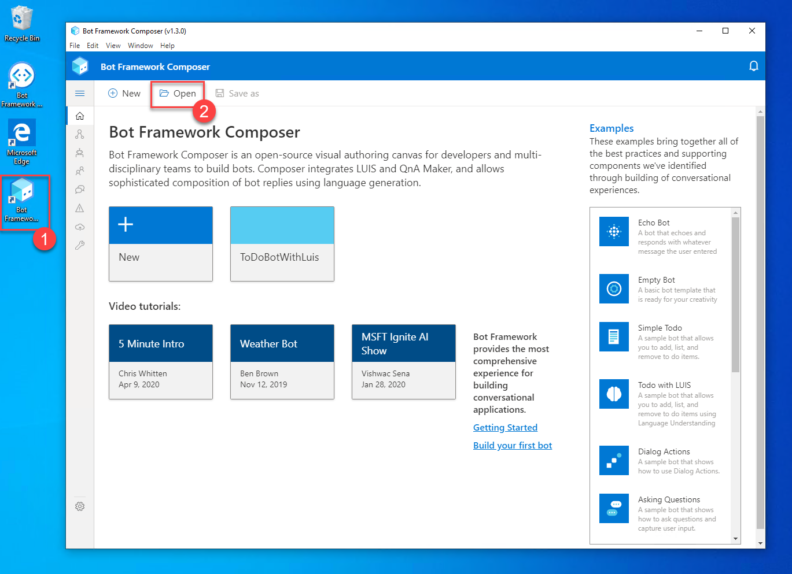

3. Navigate to your **Documents** folder **(1)**. Select the **AI-in-a-Day-Bot** by double clicking **(2)** on it.

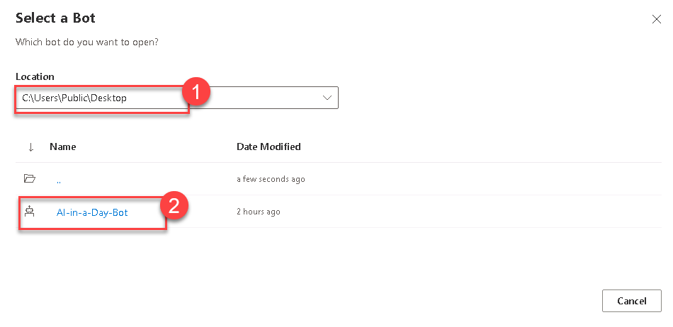

4. In a Microsoft Edge web browser *(Do not close the Bot Framework Composer)*, navigate to the Azure portal (https://portal.azure.com) and login with your credentials. Then select **Resource groups**.

5. Select the **AI-in-a-Day** resource group.

6. Select the Azure Cognitive Search service.

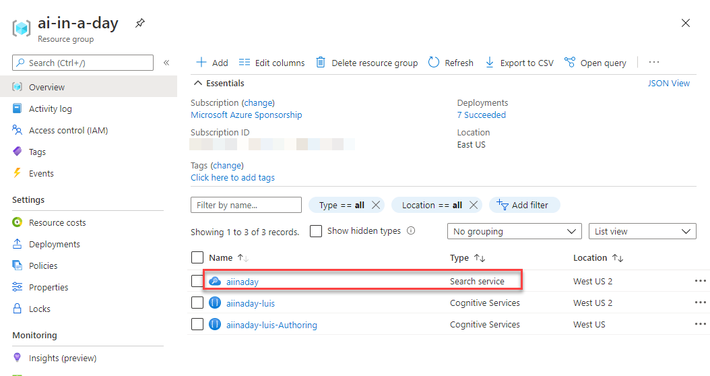

7. Select **Indexes (1)** and observe the number of documents indexed in the **cognitive-index (2)**.

8. Select **Search Explorer** to navigate to a web-based search experience where you can discover the data in the index.

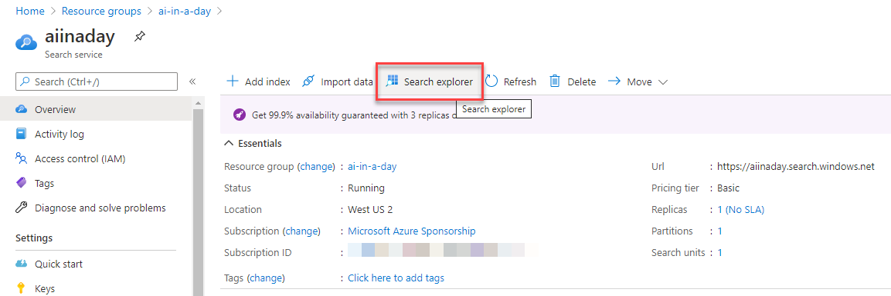

9. Select **Search (1)** to access a sample set of documents from the index. Scroll down and observe the data stored in the index. The values for the fields `people`, `organizations`, `locations`, and `keyphrases`, are created through the use of Azure Cognitive Services as part of the data enrichment process during data indexing.

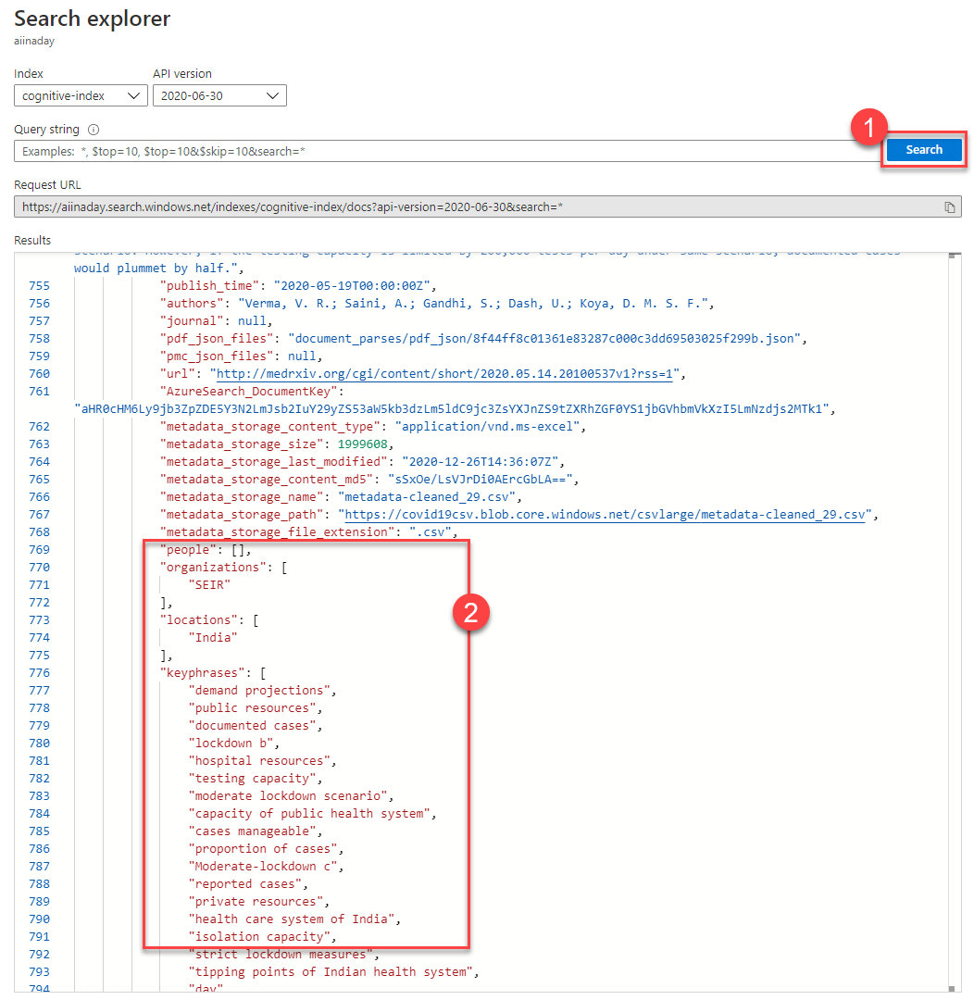

10. Close the **Search Explorer**. Navigate to the **Keys (1)** panel. Copy the primary admin key by selecting the copy command **(2)**.

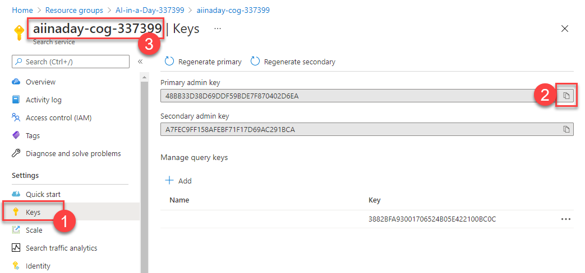

11. Now it's time to change the access keys used in our starter Bot to use our Azure Cognitive Search service. Go back to the Bot Framework Composer. Select **GetRecentResearch** trigger **(1)**. From the design, surface select the **Send an HTTP request** activity **(2)**. You will see a **Value** field **(3)** in the **Headers** section on the right panel. We have to change the value with the primary admin key we have copied from the Azure Portal. 

12. We have three more places to change the access key as we did in Step 8. Select **ResearchLookup** trigger **(1)**. From the design, surface select the **Send an HTTP request** activity **(2)**. You will see a **Value** field **(3)** in the **Headers** section on the right panel. Two more places left.

13. We have three more places to change the access key as we did in Step 8. Select **AskForMore** trigger **(1)**. From the design, surface select the **Send an HTTP request** activity **(2)**. You will see a **Value** field **(3)** in the **Headers** section on the right panel. One more left.

14. We have three more places to change the access key as we did in Step 8. Select **OrganizationBasedSearch** trigger **(1)**. From the design, surface select the **Send an HTTP request** activity **(2)**. You will see a **Value** field **(3)** in the **Headers** section on the right panel. All key replacements are now done.

## Task 2 - Running AI-in-a-Day Conversational Bot for the First Time

1. It is time to start out bot in the local Bot Framework Emulator. Select **Start bot** from the top of the window in the Bot Framework Composer.

2. Once the local bot runtime is ready, a pop-up will appear. Select **Test in Emulator** to start the local Bot Framework Emulator.

3. Write `What is the latest research?` and observe **(1)** how the bot will respond. You can see the API communication between the emulator and the bot in the list of logs **(2)**.

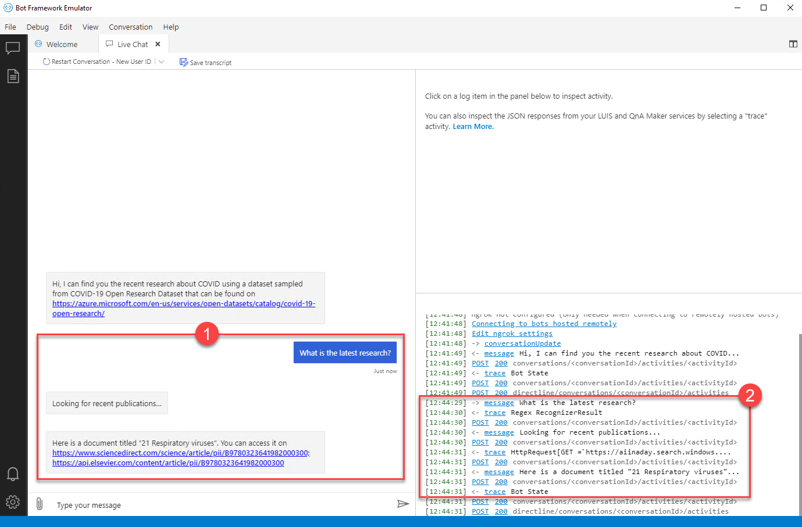

4. Write `Find me publications about SARS` and observe how the bot will respond. 

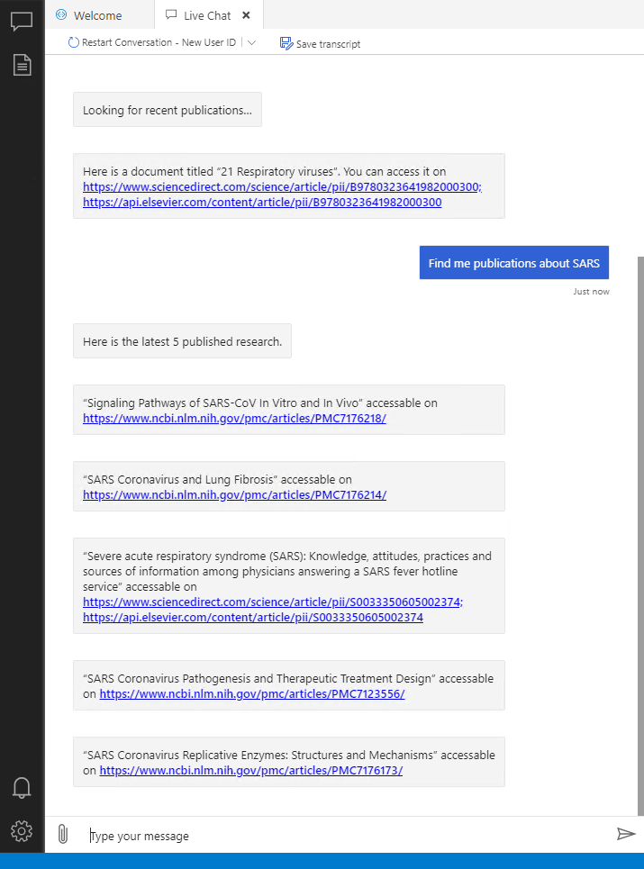

5. Write `More` and observe how the bot will respond. 

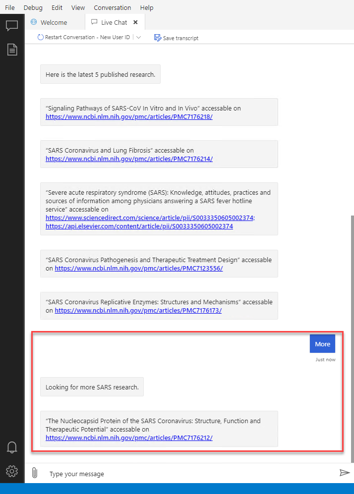

6. Write `Find me publications from WHO` and observe how the bot will respond. 

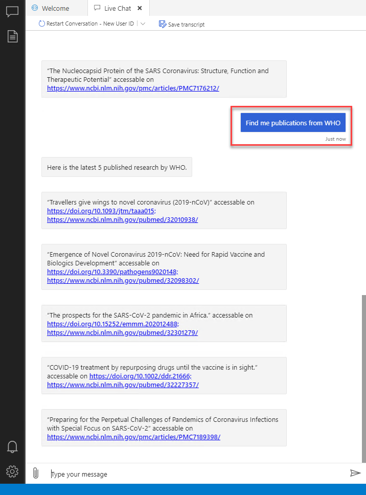

7. Now, let's go back to the **Bot Framework Composer** and see how the bot understands our commands. Select **GetRecentResearch** trigger **(1)** and look at the trigger phrase **(2)**. Our current trigger phrase is set to exactly match what we previously wrote in chat in the Bot Framework Emulator.

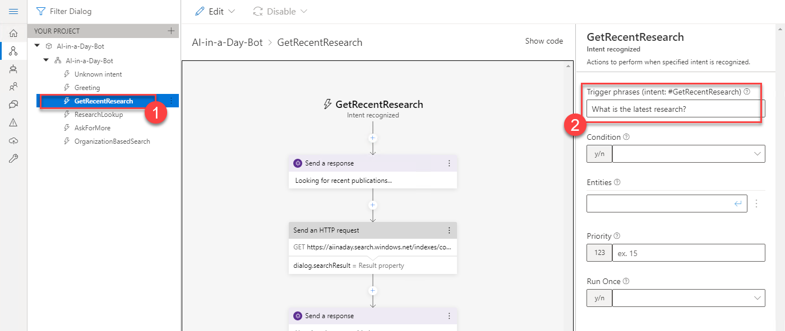

8. Switch back to the emulator and write, `What is the latest resarch?`. You will see that our bot can't understand the message anymore. So far, our bot has used **Regular Expression Recognizer** as its Language Understanding engine. The current setup for the **GetRecentResearch** trigger matches only an exact text to detect user intent. A simple typographical error results in a failure.

9. Switch back to the **Bot Framework Composer** and select **ResearchLookup (1)**. Remember, previously, we asked the bot `Find me publications about SARS` to get the latest COVID research related to SARS. You can find the regular expression used to detect the user's intent in the **Trigger Phrases (2)** section. If the user writes anything else, maybe a typographical error, the bot will fail to understand its user's intent. 

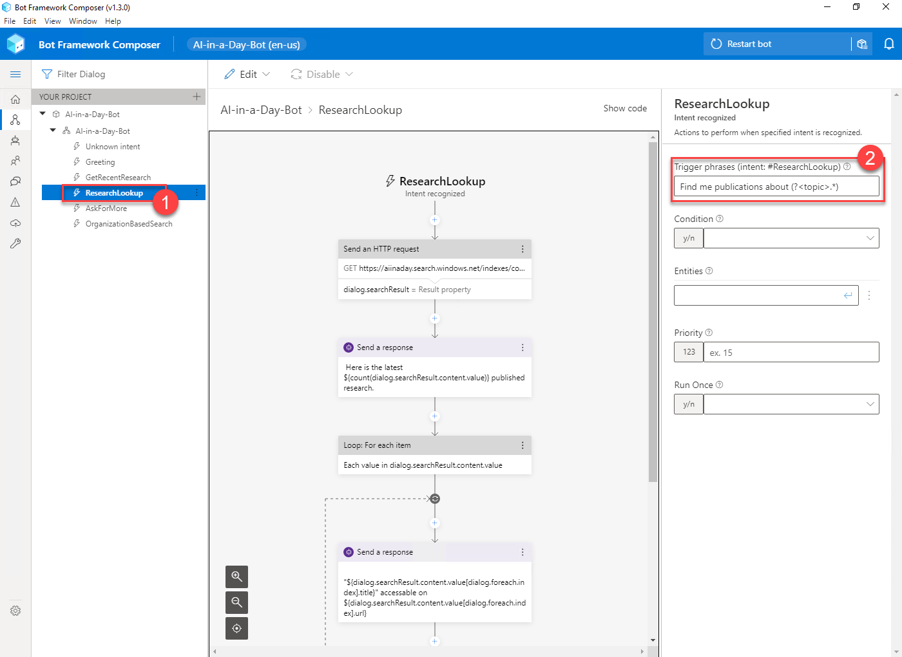

10. Feel free to look into the other triggers in the starter project and ask different questions to our bot to test how the different regular expressions set for the current triggers work.

## Task 3 - Extending Our Conversational Bot Using LUIS

## Task 4 - Deploying Our Bot to Azure Bot Service

