# Lab 4 - Data monitoring and anomaly detection using Metrics Advisor in Azure Cognitive Services 

This lab covers the Metrics Advisor service features from Azure Cognitive Services.

## Before the hands-on lab

**Duration**: 30 minutes

You should follow all of the steps provided in this section _before_ taking part in the hands-on lab ahead of time as some of these steps take time.

## Task 1 - Prepare Azure Machine Learning workspace

1. Navigate to [the Azure portal](https://portal.azure.com) and log in with your credentials. Then, select **Resource groups**.

    

2. Select the **AI-in-a-Day** resource group.

3. Select the storage account named **aiinadaystorage<inject key="DeploymentID" enableCopy="false"/>**.

    

4.  Select `Access keys` from the left side menu, and then select `Show keys`. Save the storage account name, the `key1 Key` value, and the `key1 - Connection string` value for later use.

    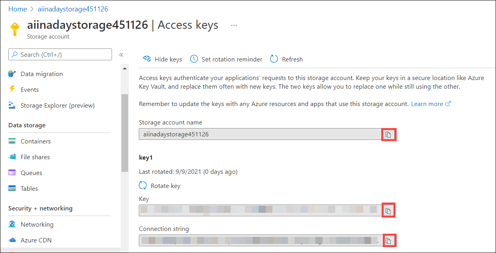

## Task 2 - Prepare the COVID cases per age group dataset

1. Navigate to back to the resource group `AI-in-a-Day`. Select the AML Workspace named **ai-in-a-day-<inject key="DeploymentID" enableCopy="false"/>**
  
    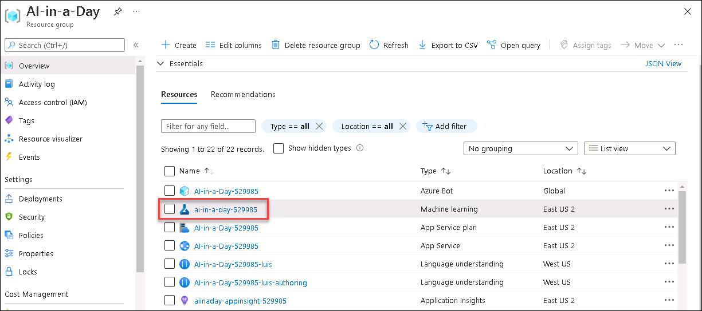
   
2. Click on **Launch Studio** button.

    

2. In Azure Machine learning studio, select **Notebooks**. If you see any popup `What's New in Notebooks`, close that.

    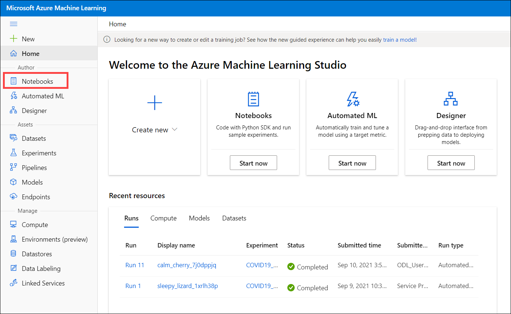

3. In the Notebooks environment, check if `preparemetricsfeeddata.ipynb` is there in **Users\odl_user_<inject key="DeploymentID" enableCopy="false"/>** folder. If it is not there dowload and import using next steps.

    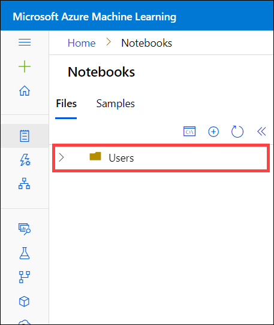

4. If the folder does not contain `preparemetricsfeeddata.ipynb` notebooks, download the following items to your local machine:

    [Prepare metrics feed data](https://solliancepublicdata.blob.core.windows.net/ai-in-a-day/lab-05/preparemetricsfeeddata.ipynb)

5. Upload the file by selecting the Upload button from the top right corner of the screen, and then selecting the blue Upload button to confirm.

    
   
   - Click on `Click to browse and select file(s)` and select the file which was just dowloaded.
   - Check the "I trust contents of the File" and select upload. 
   
    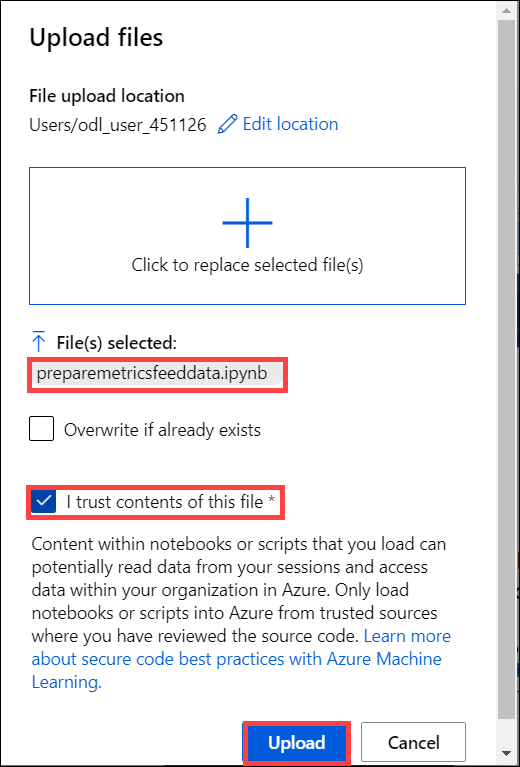

6. With the Azure Machine Learning studio and the Jupyter notebook environment open, select the `preparemetricsfeeddata.ipynb` from **Notebooks** under **Author**.

    

> **Note**: Please ensure to click on **Authenticate** button if a pop-up notification comes like below.

   

> **Note**: Make sure you replace the `<BLOBSTORAGE_ACCOUNT_NAME>` and `<BLOBSTORAGE_ACCOUNT_KEY>` values in the variable initialization cell with the values you have noted down at the end of the previous task.

   The notebook will guide you through a list of steps needed to prepare a time series-based dataset containing JSON files to be fed into the Metrics Advisor workspace. Each JSON file will contain daily data representing the count of COVID positive cases by age group.

7. Execute the notebook cell by cell (using either Ctrl + Enter to stay on the same cell, or Shift + Enter to advance to the next cell) and observe the results of each cell execution.

## Hands-on Lab

## Task 1 - Explore dashboard of COVID-19 data

Understanding the source datasets is very important in AI and ML. To help you expedite the process, we have created a Power BI dashboard you can use to explore them at the begining of each lab.

To get more details about the source datasets, check out the [Data Overview](../data-overview.md) section.

To explore the dashboard of COVID-19 data, open the `Azure-AI-in-a-Day-Data-Overview.pbix` file located on the desktop of the virtual machine provided with your environment.

## Task 2 - Explore lab scenario

Besides collecting data about COVID-19 cases, it is also essential to ensure the accuracy of the reporting. Accuracy check is where continuous monitoring of incoming data feeds doubled by automatic detection of anomalies plays a critical role. Data is valid for analysis as long as it is reliable and contains the minimum possible number of errors. With distributed data sources and numerous reporting entities, automatic anomaly detection is the best choice to minimize that number.

Using Cognitive Services Metrics Advisor, we will demonstrate how to improve the case surveillance data quality by identifying as early as possible anomalies in the number of daily reported cases.

The following diagram highlights the portion of the general architecture covered by this lab.

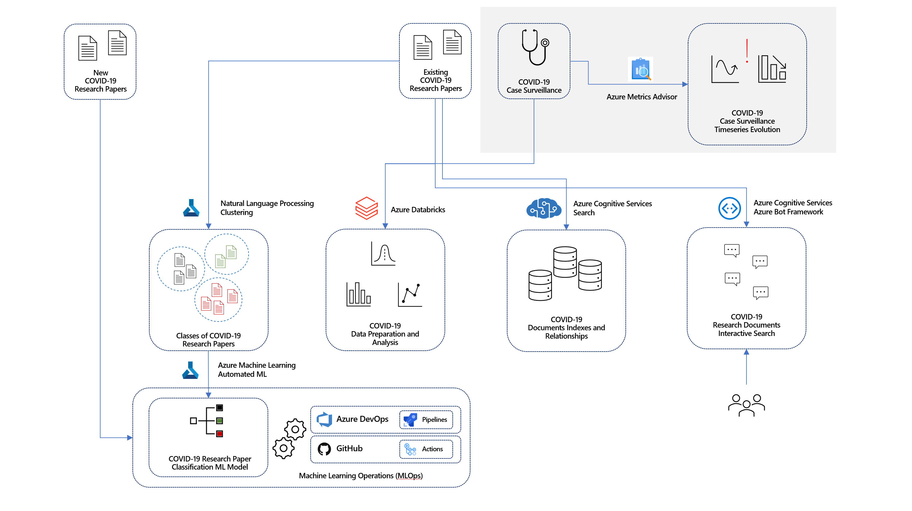

The high-level steps covered in the lab are:

- Explore dashboard of COVID-19 data
- Explore the lab scenario
- Onboard your time series data in the Metrics Advisor
- Explore anomalies detected in your data
- Perform root cause analysis
- Explore anomalies with hard thresholds (optional)

## Task 3 -  Deploy Azure Cognitive Services Metrics Advisior instance

1. Navigate to the Azure portal and click on the menu icon and select **+ Create a resource**

   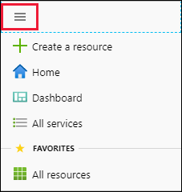  

2. In the search bar type **Metrics Advisor** and then select **Create**

   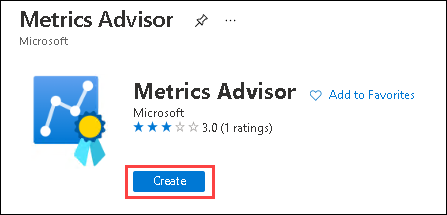  

3. Under Project details on Create Metrics Advisor page provide the following details and click **Create + Review**

    * Subscription : Select the available Subscription
    * Resource Group : **Ai-in-a-Day**
    * Region : Select the available Region from the dropdown
    * Name : **metricsadvisor-<inject key="DeploymentID" enableCopy="false"/>** 
    * Pricing tier: **S0**
    * Make sure to mark checkbox ☑ for **I confirm I have read and understood the notice below**.
   
     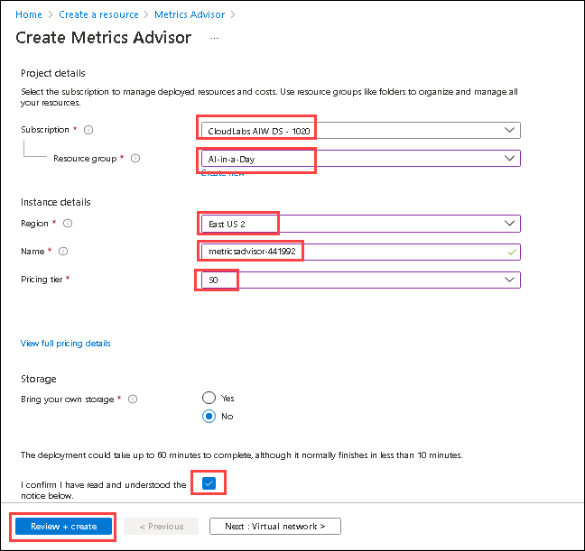

4. Once the validation is passed click on **Create**. The deployment could take up to **60 minutes** to complete, although it normally finishes in less than **10 minutes**. Please wait untill the deployment gets succeeded and then, you can proceed with next task.

## Task 4 - Configure the "COVID cases by age group" Metrics Advisor data feed

1. Back to the Home page in Azure Portal, in the list of your recent resources, locate the Azure Metrics Advisor workspace and select it. If you are prompted to sign-in again, use the same lab Azure credentials you used at the previous step.
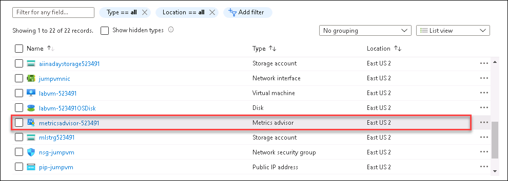

2. On the Metrics Advisor Overview page, select the `Go to workspace` link in the first section to start working with the web-based [Metrics Advisor workspace](https://metricsadvisor.azurewebsites.net/).

    

3. On the Metrics Advisor welcome page, select your Directory, subscription and workspace information and select **Get started**. You are now prepared to create your first Data feed.

    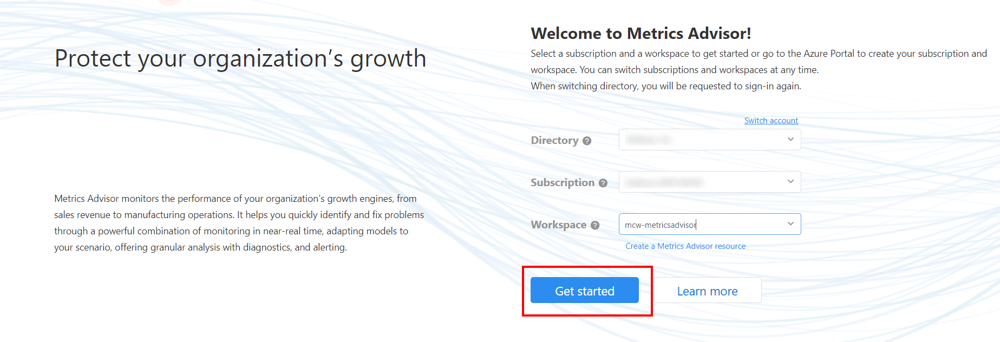

4. With the Metrics Advisor workspace opened, select the **Add datafeed** option from the left navigation menu.

5. Add the data feed by connecting to your time-series data source. Start by selecting the following parameters:

    - **Source type**: `Azure Blob Storage (JSON)`
    - **Granularity**: `Daily`
    - **Ingest data since (UTC)**: `2021-01-01`
    - **Connection string**: provide the connection string from the blob storage access keys page. (`key1 - Connection string` copied on **Before the hands-on lab** part or else please  follow Task 1 of Before the hands-on lab) 
    - **Container**: `jsonmetrics`
    - **Blob template**: `%Y-%m-%d.json` (since the daily json files are provided in with naming format)
    - **JSON format version**: `v2` (since we'll be using the age group dimension in our data schema)

    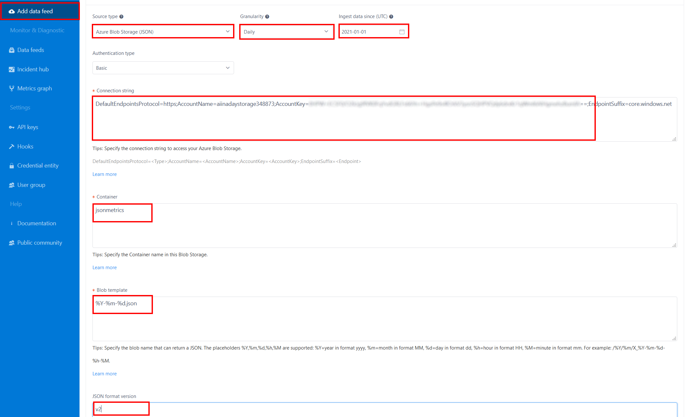

6. Select the **Load data button** to validate the configured connection, y=you can find **Load Data** option just below the **JSON format version** in right side, so scroll in right to see teh button.  If there is an error at this step, check that your connection string and blob template are correct and your Metrics Advisor instance is able to connect to the data source.

7. Once the data schema is loaded and shown like below, configure the appropriate fields as Dimension, Measure or Timestamp and select **Verify schema**.

    

8. Scroll down towards the bottom of the page. For **Automatic roll-up** settings, select the **I need the service to roll-up my data** (1) option, select the link **Set roll-up columns** and include both dimensions (3).

    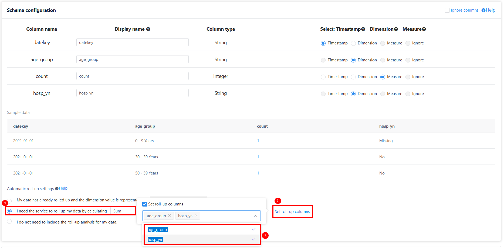

9. In the **Advanced settings** section, inside **Ingestion options**, set **Stop retrying after** to **0** hours to stop the ingestion process after the first run. 
    
    

10. In the **Misc** section, choose the option to **Fill previous** for anomaly detection model.

    

11. Provide the **Data feed name**: `covid-ages` and select **Submit** to confirm and submit the data feed.

    

12. Wait for the ingestion progress dialog and select the **Details** link in order to observe the ingestion log by timestamp. Wait until the ingestion completes with success for all ingested json files. Data ingestion can take hours, till then you can proceed to next lab and after completing the next lab come back check teh latest status on data ingestion, if you see it is completed then continue the lab from below task.

    

## Task 5 - Explore anomalies detected in data

After the data feed is added, Metrics Advisor will attempt to ingest metric data from the specified start date. It will take some time for data to be fully ingested, and you can view the ingestion status by clicking Ingestion progress at the top of the data feed page. If data is ingested, Metrics Advisor will apply detection, and continue to monitor the source for new data.

When detection is applied, you can select one of the metrics listed in data feed to find the Metric detail page to:

- View visualizations of all time series slices under this metric
- Update detecting configuration to meet expected results
- Set up notification for detected anomalies

1. Select the **Visit data-feed: covid-ages** button to navigate to the data feed overview page.

    

2.  In the data feed page, select the `count` metric under the **Metrics** section.

    

3.  To modify the inspected time window, change the start and end time of the interval from the calendar above the graphic representations. Set the interval to start from `2021-01-01`to `2021-04-15`.

    

4.  Make sure you see the ingestion process completed on recent historical data **(1)** as illustrated in the picture bellow. When all data is ingested, in the left configuration section, under the **Metric-level configuration** **(2)** change the default metric-level configuration to use Smart detection and set the sensitivity level to 81 and use this configuration:
    - Value **Out of boundary** is anomaly 
    - Do not  report anomaly until **10%** of latest **1** points are detected as anomalies.

    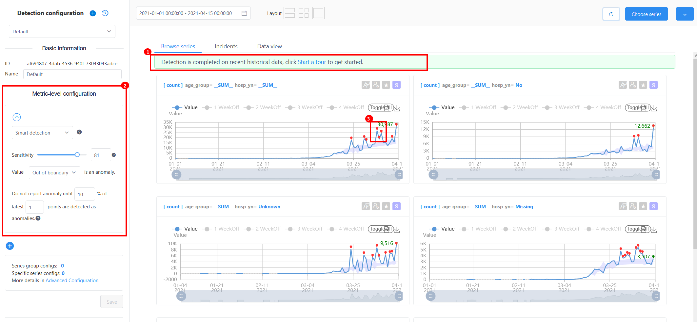

>Note
>
> - To view the diagnostic insights, click on the red dots **(3)** on time series visualizations, which represent detected anomalies and select the link **To incident hub**. 
>
> - Spend a few minutes to change some parameters inside the **Metric-level configuration** section and observe the change of reported anomalies (red points) on the series data representation.

5. In the metrics browser page, select the **Incidents** tab and filter the list to see the incidents related to number of cases that required hospitalization hosp_ym = `Yes`. Select the anomaly reported for SUM of hospitalized cases.
    

## Task 6 - Perform root cause analysis

1.  In the incidents hub, notice the **Root cause** section where you should find reported the main contributors for the detected anomaly, age groups that contributed to the sum of cases reported as anomaly. Also, in the **Diagnostic** tree, hover on each age group node to investigate its contribution to the incident.
    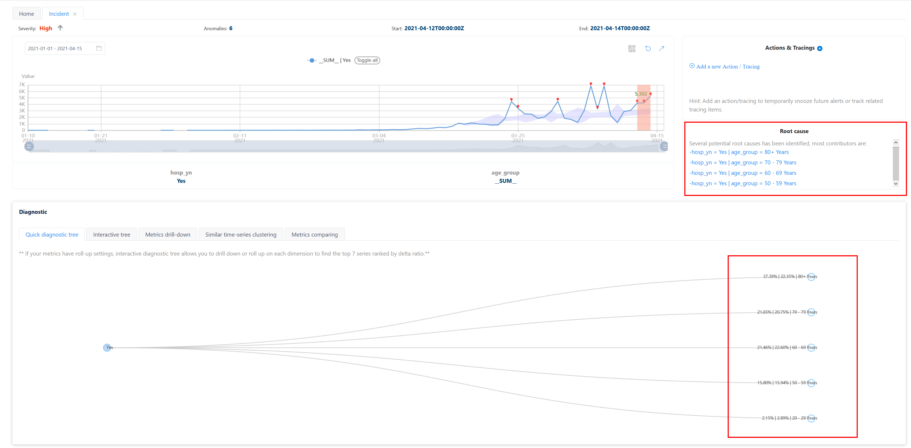

2.  In the **Diagnostics** (1) section, navigate to **Metrics drill-down** (2) and notice the current point Value (number of cases) and the **Diff**  from the identified **Baseline** (3). Choose the **age_group** dimension to drill-down by it and check the same **Delta** percent and **Diff** value from the baseline for the anomalies detected in the current point.
    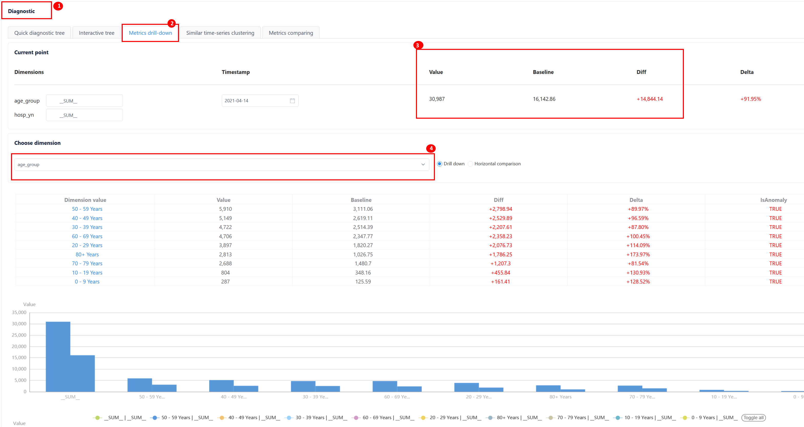

## Task 7 - Explore anomalies with hard thresholds (optional)

As an optional exercise, you can create a different detection configuration, based on hard thresholds rather than smart detection.

To do this, go back to the metric detection configuration screen and try a new configuration as follows **(1)**:

- **Hard threshold**
- Value **Out of range** Min: **1000** and Max: **9000** is an anomaly
- Do not report anomaly until 100% of latest **10** points are detected as anomalies

We should have marked as anomalies the points in time where number of cases is bellow or above a fixed threshold for 10 continous points in time.(Notice the yellow dots **(2)** before the reported anomalies and how the threashold is delimited by the red horizontal lines **(3)**).

