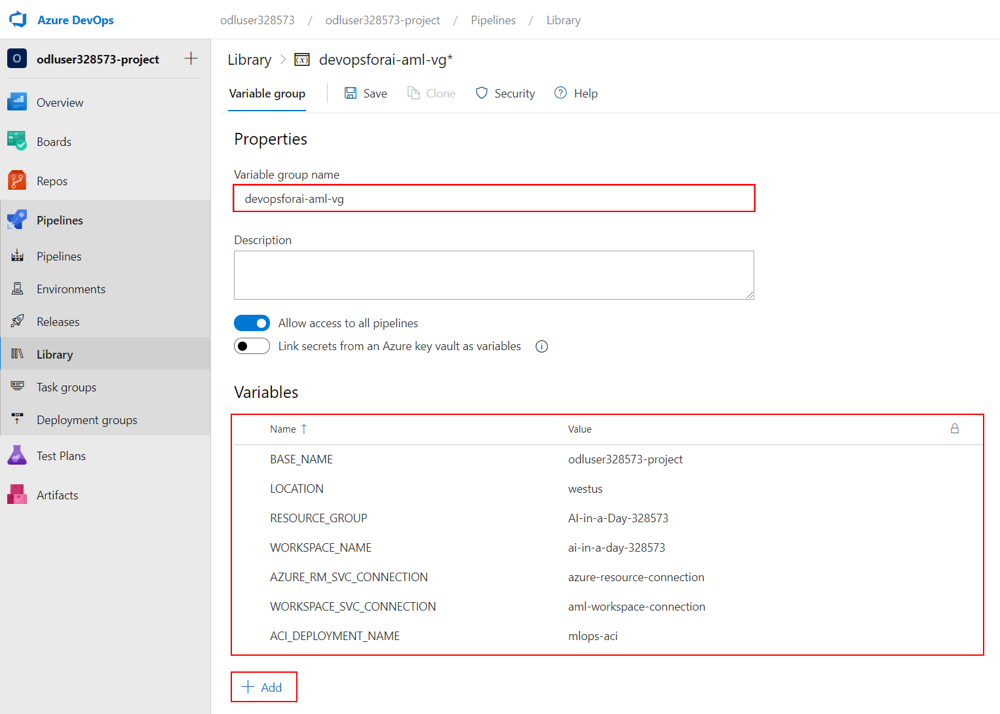
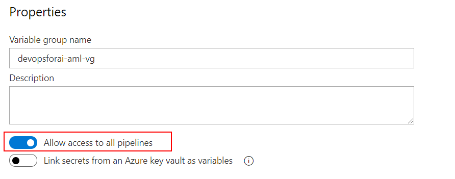
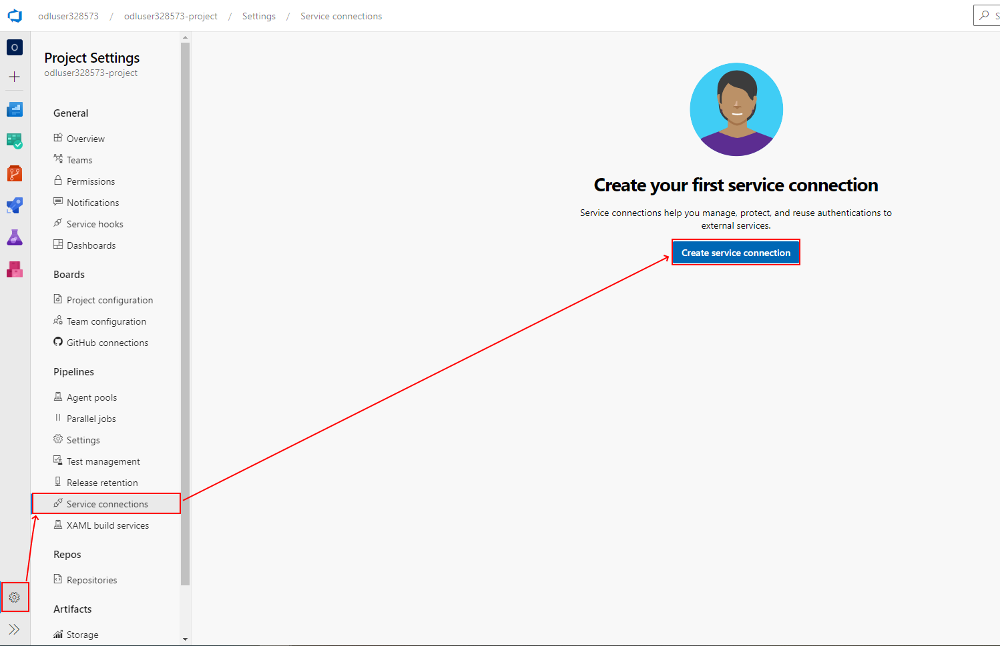
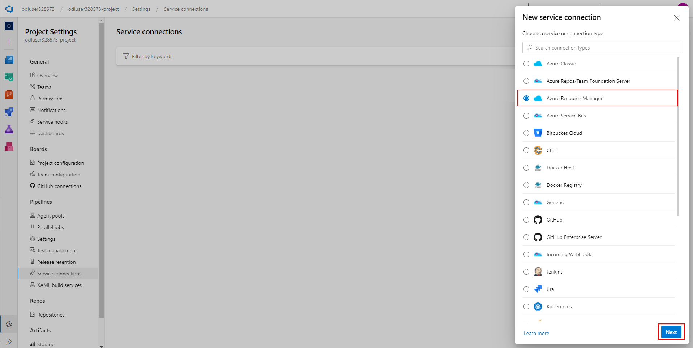
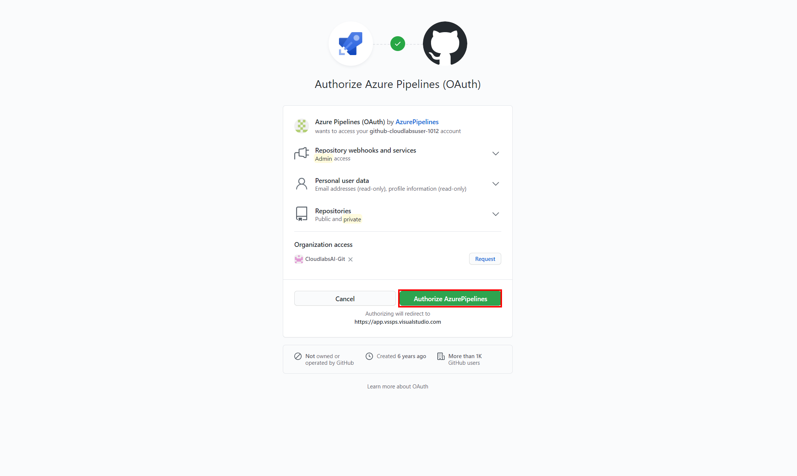
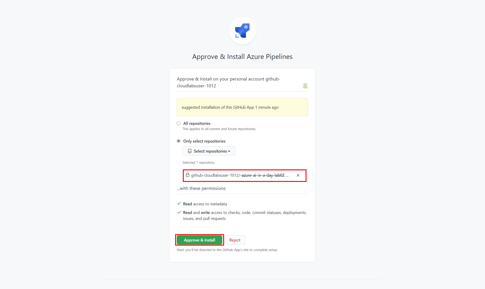
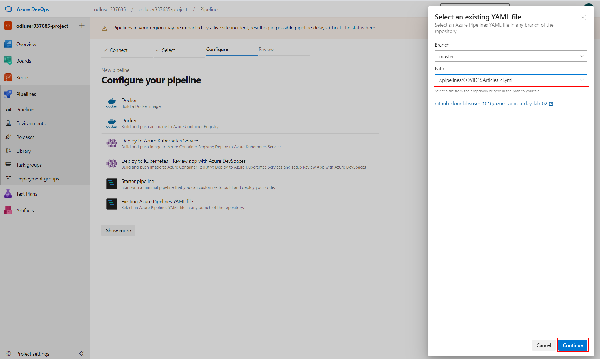
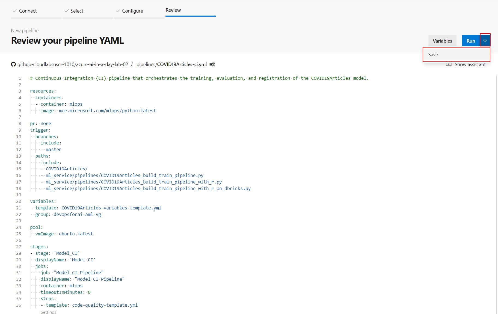
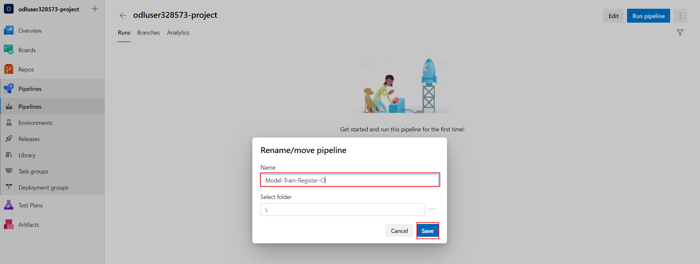
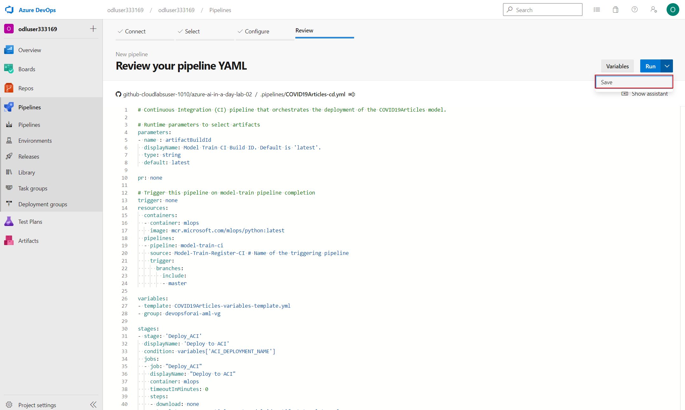

# Setup the Lab 02 AI-in-a-Day Workspace

## Task 1 - Configure the Azure DevOps project and required Variable group

1. Open the [Azure DevOps portal](https://dev.azure.com/) and select the **Sign in to Azure DevOps** link.

    

2. To sign-in, use the Azure credentials provided by the lab environment.

3. First time you sign-in to your Azure DevOps account, you are asked to create a new project in the pre-created organization you have available, named `odluserXXXXXX`. Provide the project name in the following form `odluserXXXXXX-project` and select **+ Create project**

    

>Note: Please make sure you check the pre-installed extensions at >AzureDevOps organization level: 

4. MLOpsPython requires some variables to be set before you can run any pipelines. At this step, you'll create a variable group in Azure DevOps to store values that are reused across multiple pipeline stages. Navigate to **Pipelines**, **Library** and in the **Variable groups** section select **+ Variable group** as indicated bellow.

    

5. To prepare the values you'll need to set all your variables, you need to get the resource group location where all your Azure resources were provisioned. In another browser tab, navigate to the [Azure portal](https://portal.azure.com), sign in with the provided Azure credentials if you are asked to, and navigate to the lab Resource group. On the resource group overview page, you'll find the location information you need.

    

    Also note the other two marked values in the image above (you'll also need those two on the next steps): the **Resource Group name** and the **Machine Learning Workspace name**, which are also provided for you in the lab Environment Details page.

6. Going back to the Azure Devops portal where you created the Variable group for you DevOps project, enter the **Variable group name**: `devopsforai-aml-vg`.

7. Add the required list of variables, using the **+ Add** link at the bottom of the **Variables** section as illustrated in the image bellow:

    

    Use values listed in the table:

    | Variable Name            | Suggested Value           | Short description                                                                                                           |
    | ------------------------ | ------------------------- | --------------------------------------------------------------------------------------------------------------------------- |
    | BASE_NAME                | [your project name] e.g. `odluserXXXXXX-project`     | Unique naming prefix for created resources - max 10 chars, letters and numbers only                                         |
    | LOCATION                 | `westus`                 | Resource group location (the value you looked for on the previous step)                             |
    | RESOURCE_GROUP           | `AI-in-a-Day-XXXXXX`                | Azure Resource Group name                                                                                                   |
    | WORKSPACE_NAME           | `ai-in-a-day-XXXXXX`             | Azure Machine Learning Workspace name                                                                                                     |
    | AZURE_RM_SVC_CONNECTION  | `azure-resource-connection` | [Azure Resource Manager Service Connection](#create-an-azure-devops-service-connection-for-the-azure-resource-manager) name |
    | WORKSPACE_SVC_CONNECTION | `aml-workspace-connection`  | [Azure ML Workspace Service Connection](#create-an-azure-devops-azure-ml-workspace-service-connection) name                 |
    | ACI_DEPLOYMENT_NAME      | `mlops-aci`                 | [Azure Container Instances](https://azure.microsoft.com/en-us/services/container-instances/) name                           |                 |

8. Make sure you select the **Allow access to all pipelines** checkbox in the variable group configuration.

    

9. Select **Save** from the top menu to create the variable group.

    

## Task 2 - Create an Azure DevOps Service Connection for the Azure ML Workspace

Create a new service connection to your Azure ML Workspace to enable executing the Azure ML training pipeline. The connection name needs to match the WORKSPACE_SVC_CONNECTION that you set in the variable group above (e.g. `aml-workspace-connection`).

1. Go to **Project settings**, **Service connections** and select **Create service connection** as illustrated bellow.

    

2. Select the connection type from the available list: **Azure Resource Manager** and select **Next**.

    

3. Provide the authentication method: **Service principal (automatic)** and move **Next**.

    

4. Select scope level: **Machine Learning Workspace** and select the available **Subscription**, **Resource group** and **Machine Learning Workspace** provided in the lab environment. Enter `aml-workspace-connection` for the **Service connection name** and select **Save**.

    

>Note:
>
>Creating a service connection with Azure Machine Learning workspace scope requires `Owner` or `User Access Administrator` permissions on the Workspace. You'll need sufficient permissions to register an application with your Azure AD tenant, or you can get the ID and secret of a service principal from your Azure AD Administrator. That principal must have Contributor permissions on the Azure ML Workspace.

## Task 3 - Import the GitHub repository

1. Go to the [GitHub portal](https://github.com/) and sign in with the Git credentials provided for you.
2. You will be asked to verify your account, so you should open your user's mailbox on https://outlook.office365.com/ to be able to receive the verification codes for GitHub authentication. Use the same GitHub user account credentials to open Outlook.

3. In GitHub, while authenticated with the lab user, navigate to the following link to create a new git repository from the provided template:
   https://github.com/solliancenet/azure-ai-in-a-day-lab-02-starter/generate

4. Set the repository name to `azure-ai-in-a-day-lab02` and select **Create repository from template**.

    

5. When the new repository is generated, copy your repository URL from the browser address bar since you will need it in the next steps.


## Task 4 - Set up Build, Release Trigger, and Release Multi-Stage Pipelines

Now that you've provisioned all the required Azure resources and service connections, you can set up the pipelines for training (CI) and deploying (CD) your machine learning model to production. Additionally, you can set up a pipeline for batch scoring.
In the following steps you will create and run a new build pipeline based on the `COVID19Articles-CI.yml` pipeline definition in your imported repository.

1. In your Azure DevOps project summary page, navigate to the **Pipelines** section from the left navigation menu. Select **Create Pipeline**.

    

2. Select the code location: **GitHub**.

    

3. Next you will be asked to authorize Azure Pipelines to access your GitHub account. If prompted with the GitHub sign in page, provide the GitHub credentials listed in the lab environment credentials page.

    

4. If you are already signed in to GitHub, you will be prompted with the Authorize Azure Pipelines (OAuth) page. Select **Authorize AzurePipelines**.

    

5. Redirected back to Azure Devops, select the available Git repository, the one you generated during the previous task in this lab: `github-clouduser-XXXX/azure-ai-in-a-day-lab-02`.

    

6. After you authorized the access for Azure Pipelines, you'll be asked to approve and install Azure Pipelines on your personal GitHub account. Select the `azure-ai-in-a-day-lab02` repository and select **Approve & Install**.

    

7. After approving installation, you might be asked to sign in again to Azure Devops, so you have to provide the Azure credentials provided in the lab environment. Next, in case you are asked, you will have to authorize Azure Pipelines permissions on your GitHub account. Select **Authorize Azure Pipelines** on this page.

    

8. Back to Azure Devops, in the **Configure pipeline** step, select the **Existing Azure Pipelines YAML file**.

    

9. Leave the default branch selected and paste the path to the YAML file: `/.pipelines/COVID19Articles-ci.yml`. Select **Continue**.

    

10. In the **Review** step, take a moment to observe the code inside the YAML file and then expand the **Run** menu and select **Save**.

    

11. With the created pipeline, select **Rename/move** from the right menu as illustrated bellow:

    

12. Change the pipeline name to: `Model-Train-Register-CI` and select **Save**.

    

13. Run the pipeline by selecting the **Run pipeline** button. Leave the default values on the next dialog and hit **Run**. Wait for the pipeline run to complete (it can take up to 20-25 minutes for the pipeline to finish).

    

>Note
>
>While waiting for the CI pipeline to finish, given that it will take 20-25 minutes to complete, you can move on with steps 1 to 9 in the next task to create the release deploy pipeline. Note that you cannot run this second pipeline until the first one is not completed. When both pipelines are created, the CI pipeline triggers the start of the CD one.

## Task 5 - Set up the Release Deployment pipeline

1. Open the [Azure DevOps portal](https://dev.azure.com) and sign in with the Azure credentials provided for you in the lab environment.
   
2. In your current organization, open the Azure DevOps project summary page and navigate to the **Pipelines** section from the left navigation menu. Select **New Pipeline**.
   
    

3. Select the code location: **GitHub**.
   
    

4. Select the Git repository you already used for the first pipeline: `github-clouduser-XXXX/azure-ai-in-a-day-lab-02`.
   
    

5. In the **Configure pipeline** step, select the **Existing Azure Pipelines YAML file**.
   
    

6. Leave the default branch selected and paste the path to the YAML file: `/.pipelines/COVID19Articles-cd.yml`. Select **Continue**.
   
    

7. In the **Review** step, take a moment to observe the code inside the YAML file and then expand the **Run** menu and select **Save**.
   
    

8. With the created pipeline, select **Rename/move** from the right menu as illustrated bellow:
   
    

9. Change the pipeline name to: `Model-Deploy-CD` and select **Save**.
   
    

10. Run the pipeline by selecting the **Run pipeline** button. Leave the default values on the next dialog and hit **Run**. Wait for the pipeline run to complete (it can take up to 20-25 minutes for the pipeline to finish).
   
    

## ML Ops with GitHub Actions and AML environment setup

1. Sign-in to GitHub with your GitHub account.

2. Navigate to the already genarated repository for this lab and select 
 **Settings** in order to configure the required secrets to allow GitHub Actions to access Azure.

    First you will need an [Azure service principal](https://docs.microsoft.com/en-us/azure/active-directory/develop/app-objects-and-service-principals). Just go to the Azure Portal to find the details of your resource group. Then start the Cloud CLI or install the [Azure CLI](https://docs.microsoft.com/en-us/cli/azure/install-azure-cli?view=azure-cli-latest) on your computer and execute the following command to generate the required credentials:

    ```sh
    # Replace {sp_XXXXX_githubactions} where XXXXX is the current user lab unique code, {subscription-id} and {AI-in-a-Day-XXXXX},{ai-in-a-day-XXXXX} with your 
    # Azure subscription id, resource group and ml workspace name and assign any name for your service principal for eg {sp_XXXXX_githubactions}
    
    az ad sp create-for-rbac --name http://{sp_XXXXX_githubactions} \
                            --role contributor \
                            --scopes /subscriptions/{subscription-id}/resourceGroups/{AI-in-a-Day-XXXXX}/providers/Microsoft.MachineLearningServices/workspaces/{ai-in-a-day-XXXXX} \
                            --sdk-auth
    ```

    This will generate the following JSON output:

    ```sh
    {
        "clientId": <GUID>,
        "clientSecret": <secret>,
        "subscriptionId": <GUID>,
        "tenantId": <GUID>,
        "activeDirectoryEndpointUrl": "https://login.microsoftonline.com",
        "resourceManagerEndpointUrl": "https://management.azure.com/",
        "activeDirectoryGraphResourceId": "https://graph.windows.net/",
        "sqlManagementEndpointUrl": "https://management.core.windows.net:8443/",
        "galleryEndpointUrl": "https://gallery.azure.com/",
        "managementEndpointUrl": "https://management.core.windows.net/"
    }
    ```

3. On the **Settings** tab in your repository select the Secrets section and finally add the new secret (JSON output generated at the previous step) with the name `AZURE_CREDENTIALS` to your repository.

      

4. To allow Azure to trigger a GitHub Workflow we also need a GitHub PAT token with `repo` access so that we can trigger a GH workflow when the training is completed on Azure Machine Learning. In GitHub, under your GitHub logged in user in the right corner, select Settings > Develper Settings > Personal access tokens. Enter a name for the new PAT and select **Generate** at the bottom of the page.

    

5. Copy the new GH PAT.

    

6. At repository level, select Settings > Secrets and add the PAT token with the name `PATTOKEN` as a new secret.
 
    

7. Open the .cloud\.azure\workspace.json file and replace the workspace name and resource group with the ones provided by the lab environment.

    

    


## Setup and Define Triggers

### Events that trigger workflow

Github workflows are triggered based on events specified inside workflows. These events can be from inside the github repo like a push commit or can be from outside like a webhook([repository-dispatch](https://docs.github.com/en/developers/webhooks-and-events/webhook-events-and-payloads#repository_dispatch)).
Refer [link](https://docs.github.com/en/actions/reference/events-that-trigger-workflows) for more details on configuring your workflows to run on specific events.


#### Define Trigger
We have created sample workflow file [deploy_model](/.github/workflows/deploy_model.yml) that gets triggered on repository dispatch event `machinelearningservices-runcompleted` as defined [here](/.github/workflows/deploy_model.yml#L4) . This workflow deploys trained model to azure kubernetes.

If you add this repository dispatch event `machinelearningservices-runcompleted` in other workflows, they will also start listening to the machine learning workspace events from  the subscribed workspace.

### 5. Testing the trigger

We have created sample workflow file [train_model.yml](/.github/workflows/train_model.yml) to train the model. You need to update this workflow file [train_model.yml](/.github/workflows/train_model.yml)  by doing a commit to  this file or to any file under 'code/' folder.

This workflow trains the model and on successful training completion triggers  workflow [deploy_model](/.github/workflows/deploy_model.yml) that deploys the model.

### 6. Review 

Any change to training file [train.py](https://github.com/Azure-Samples/mlops-enterprise-template/blob/main/code/train/train.py) will trigger workflow [train_model.yml](/.github/workflows/train_model.yml) and train the model using updated training code.
After this training completes [deploy_model.yml](/.github/workflows/deploy_model.yml ) will automatically be triggered and deploy model to the AKS instance.

The log outputs of this workflow [deploy_model.yml](/.github/workflows/deploy_model.yml ) run will provide URLs for you to get the service endpoints deployed on kubernetes. 


### 7. Next Steps: Add Storage Triggers

As next steps, you can setup similar triggers on updates to [Azure Storage](https://azure.microsoft.com/en-gb/services/storage/) account. So, if you are using Azure Storage for storing your training data any update to the data will auto trigger the training on new data and will auto deploy the updated model too. 

You would need an Azure Storage account in the same resource group as above.  To create a new storage account use [link](https://ms.portal.azure.com/#create/Microsoft.StorageAccount-ARM). 

Follow there two steps to enable triggerring of GitHub Workflows on Storage Account updates. 
- Remove comments in [deploy.core-infra.json](/infra/deploy.core-infra.json) (  [line 562](/infra/deploy.core-infra.json#L562) and [line 600](/infra/deploy.core-infra.json#L562)).
- Update `STORAGE_ACCOUNT` variable in [setup.yml](/.github/workflows/setup.yml) with the Storage Name you created above. 

A commit to setup.yml will enable [train_model.yml](/.github/workflows/train_model.yml) to be executed on any change in Storage Account. 


## Documentation

### Code structure

| File/folder                   | Description                                |
| ----------------------------- | ------------------------------------------ |
| `COVID19Articles_GH`                        | Sample data science source code that will be submitted to Azure Machine Learning to train and deploy machine learning models. |
| `COVID19Articles_GH/train`                  | Sample code that is required for training a model on Azure Machine Learning. |
| `COVID19Articles_GH/train/train_aml.py`         | Training script that gets executed on a cluster on Azure Machine Learning. |
| `COVID19Articles_GH/train/environment.yml`  | Conda environment specification, which describes the dependencies of `train_aml.py`. These packages will be installed inside a Docker image on the Azure Machine Learning compute cluster, when executing your `train_aml.py`. |
| `COVID19Articles_GH/train/run_config.yml`   | YAML files, which describes the execution of your training run on Azure Machine Learning. This file also references your `environment.yml`. Please look at the comments in the file for more details. |
| `COVID19Articles_GH/deploy`                 | Sample code that is required for deploying a model on Azure Machine Learning. |
| `COVID19Articles_GH/deploy/score.py`        | Inference script that is used to build a Docker image and that gets executed within the container when you send data to the deployed model on Azure Machine Learning. |
| `COVID19Articles_GH/deploy/environment.yml` | Conda environment specification, which describes the dependencies of `score.py`. These packages will be installed inside the Docker image that will be used for deploying your model. |
| `COVID19Articles_GH/test/test.py`           | Test script that can be used for testing your deployed webservice. Add a `deploy.json` to the `.cloud/.azure` folder and add the following code `{ "test_enabled": true }` to enable tests of your webservice. Change the code according to the tests that zou would like to execute. |
| `.cloud/.azure`               | Configuration files for the Azure Machine Learning GitHub Actions. Please visit the repositories of the respective actions and read the documentation for more details. |
| `.github/workflows`           | Folder for GitHub workflows. The `train_deploy.yml` sample workflow shows you how your can use the Azure Machine Learning GitHub Actions to automate the machine learning process. |


### Documentation of Azure Machine Learning GitHub Actions

The template uses the open source Azure certified Actions listed below. Click on the links and read the README files for more details.
- [aml-workspace](https://github.com/Azure/aml-workspace) - Connects to or creates a new workspace
- [aml-compute](https://github.com/Azure/aml-compute) - Connects to or creates a new compute target in Azure Machine Learning
- [aml-run](https://github.com/Azure/aml-run) - Submits a ScriptRun, an Estimator or a Pipeline to Azure Machine Learning
- [aml-registermodel](https://github.com/Azure/aml-registermodel) - Registers a model to Azure Machine Learning
- [aml-deploy](https://github.com/Azure/aml-deploy) - Deploys a model and creates an endpoint for the model


### ARM template to deploy azure resources

The workflow file 'setup.yml' deploys arm template to azure using standard azure CLI deploy command.
Arm Template [deploy.core-infra.json](/infra/deploy.core-infra.json) is used to deploy azure resources to azure . It uses the parameters provided in file [deploy.core-infra.params.json](/infra/params.deploy.core-infra.json)  to create new resources or update the resources if they are already present.

### Documentation of template file parameters

| Parameter                  | Description                                |
| ----------------------------- | ------------------------------------------ |
| `workspaceName`                        | Specifies the name of the Azure Machine Learning workspace.If the resource doesn't exist a new workspace will be created, else existing resource will be updated using the arm template file |
| `baseName`                  | Name used as base-template to name the resources to be deployed in Azure. |
| `OwnerName`         | Owner of this deployment, person to contact for question. |
| `GitHubBranch`  | Name of the branch containing azure function code. |
| `eventGridTopicPrefix`   | The name of the Event Grid custom topic. |
| `eventGridSubscriptionName`                 | The prefix of the Event Grid custom topic's subscription. |
| `FunctionName`        |name of azure function used|
| `subscriptionID` | azure subscription ID being used for deployment |
| `GitHubURL`           | The URL of GitHub (ending by .git) containing azure function code. |
| `funcProjectFolder`               | The name of folder containing the function code. |
| `repo_name`           | The name of repository containing template files.This is picked up from github environment parameter 'GITHUB_REPOSITORY' |
| `pat_token`                        | pat token to be used by the function app to communicate to github via repository dispatch. |


### Event Grid Subscription

User can modify the deploy_event_grid.json arm template to add/remove the storage events that he/she 
wants to subscribe to [here](https://github.com/Azure-Samples/mlops-enterprise-template/blob/eb32e4df6e9124777e9d5216a7b3841992f03924/infra/deploy.core-infra.json#L526). These are the available events from storage account :
```sh

Microsoft.Storage.BlobCreated
Microsoft.Storage.BlobDeleted
Microsoft.Storage.BlobRenamed
Microsoft.Storage.DirectoryCreated
Microsoft.Storage.DirectoryRenamed
Microsoft.Storage.DirectoryDeleted

```


# Setup Azure DevOps

Setup an Azure DevOps project in an Azure DevOps tenant.


